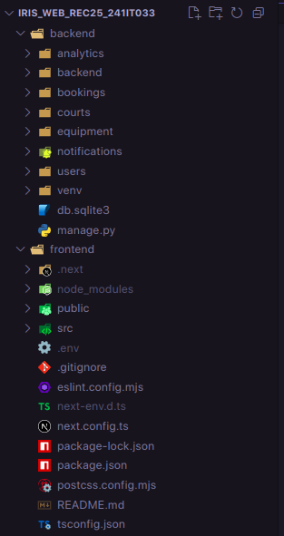

# 🏆 Sports Infrastructure Booking System

A **fast, secure, and reliable** sports infrastructure booking system built for **NITK**. This system allows students and faculty to book sports courts and equipment seamlessly. It leverages **Django (backend) and Next.js (frontend)** to ensure high performance and a smooth user experience.

--- 
Here is the video going through the features: 
`https://drive.google.com/file/d/1dgDLpaIuJqWGvnrYOl_R71wUusoDnoYo/view?usp=drivesdk`
---

## 🚀 Why This System?

### ⚡ Speed

- **Optimized database queries** ensure quick responses.
- **Efficient caching mechanisms** reduce unnecessary computations.
- **Real-time updates** prevent double booking of slots.

### 🔐 Security

- **Role-based access control (RBAC)** ensures only authorized users can perform certain actions.
- **JWT authentication** keeps user data safe.
- **Input validation & sanitization** prevent security vulnerabilities.

---

## 📌 Installation Guide

This guide assumes that you either have ubuntu or mac. Steps may vary for windows.

### Clone the Repository

Start by cloning the `dev` branch of the project:

```bash
cd /desktop/dev/

git clone -b dev https://github.com/harshithv25/IRIS_Web_Rec25_241IT033.git

cd IRIS_Web_Rec25_241IT033/
```

---

### 🔧 Backend Setup (Django)

#### 1️⃣ Navigate to the backend folder

```bash
cd backend/
```

#### 2️⃣ Create and activate a virtual environment 

delete the existing venv folder from the git clone

```bash
python3 -m venv venv
source venv/bin/activate  # On Windows use: venv\Scripts\activate
```

#### 3️⃣ Install dependencies

```bash
pip install -r requirements.txt
```

#### 4️⃣ Set up the database

```bash
python manage.py makemigrations
python manage.py migrate
```

#### 5️⃣ Create a superuser (optional)

```bash
python manage.py createsuperuser
```

#### 6️⃣ Start the Django server

```bash
python manage.py runserver
```

---

### 🌐 Frontend Setup (Next.js)

#### 1️⃣ Navigate to the frontend folder

```bash
cd ../frontend
```

#### 2️⃣ Install dependencies

```bash
npm install
```

#### 3️⃣ Start the development server

```bash
npm run dev
```

MONGODB IS REQUIRED! Make sure you already have mongodb installed locally (as it doesnt run on NITK-NET) once you have it installed type

```bash
mongosh
```

and copy the url that looks something like this `mongodb://127.0.0.1:27017/_!addDatabaseNameHere!_?directConnection=true&serverSelectionTimeoutMS=2000&appName=mongosh+2.4.2`

go to `settings.py` and change `MONGO_URI` to `mongodb://127.0.0.1:27017/IRIS_WEB_REC25_241IT033?directConnection=true&serverSelectionTimeoutMS=2000&appName=mongosh+2.4.2` (your url also should like this or is this in most cases)

change `MONGO_DB_NAME` = `IRIS_WEB_REC25_241IT033` make sure the db names are correct in `MONGO_URI` and `MONGO_DB_NAME`

#### 4️⃣ Start the redis and celery server(Can skip this as it doesnt break the application)

```bash
celery -A backend worker --loglevel=info
celery -A backend beat --loglevel=info  # If using periodic tasks
```

If some error occurs check if the config is correct in settings.py an celery.py. Also ensure redis is running

```bash
ps aux | grep redis
```

Now, the frontend should be running at `http://localhost:3000/` and the backend at `http://localhost:8000/`. 🎉

---

## 📂 Project Structure

### **Backend (Django)**

```
backend/
│── analytics/        # Analysis Model Data
│── bookings/         # Booking logic (models, views, serializers)
│── users/            # Authentication and user roles
│── notifications/    # Email & real-time alerts
│── tests/            # Backend test cases
│── backend/          # Main project settings
│── manage.py         # Django entry point
│── requirements.txt  # Dependencies
```

### **Frontend (Next.js)**

```
src/
│── components/       # Reusable UI components
│── context/          # Global state management
│── app/            # Main routes
│── services/         # API calls
│── utils/            # Helper functions
│── public/           # Static assets
│── styles/           # Global styles
│── package.json      # Dependencies
```

### 📸 Folder Structure

## 

## 🔗 How Everything is Connected

- **Frontend & Backend Communication**  
  The **Next.js frontend** communicates with the **Django backend** via **REST API endpoints**.
- **Authentication**
  - JWT tokens are used for secure login and user sessions.
  - Only **admins** can manage court bookings.
- **Error Handling**
  - Backend **Django middleware** catches exceptions.
  - Frontend **custom error handlers** ensure a smooth user experience.
- **State Management**
  - **Context API** in Next.js binds the entire frontend together, managing user sessions and UI state.

---

## 🔥 Features

### ✅ **1. User Authentication**

- **JWT-based login & signup**
- **Role-based access** (User & Admin)

### 🏟️ **2. Sports Court Booking**

- **Real-time availability** updates
- **Easy rescheduling & cancellations**
- Join **waitlists** if there is already a booking

### 🏓 **3. Equipment Reservation**

- Book sports equipment like **bats, balls, rackets**
- View available equipment in **real time**

### 📅 **4. Scheduled Notifications**

- Users get **email alerts** 30 minutes before their booking
- Admins get notified for **cancellations & bookings**

### 📊 **5. Dashboard & Reports**

- Admins can see **booking analytics**
- Users can **track their past bookings**

### 🔐 **6. Security Features**

- **Role-based access control** prevents unauthorized actions
- **Form validation & input sanitization** to block XSS/SQL Injection
- **CSRF protection** enabled in Django
- **JWT Tokens** enabled in Django and Next js Frontend

### 🛸 **7. Misc.**

- **Join waitlist if the booking is already present in the same slot as you want**
- **Scheduling emails using redis and celery**
- **Penalty System** admin can add penalty to an user if the produc is damaged

---

## 🛠️ Technologies Used

- **Backend:** Django, Django REST Framework
- **Frontend:** Next.js, TypeScript
- **Database:** MongoDB
- **Authentication:** JWT + CSRF Tokens
- **Task Scheduling:** Celery + Redis
- **Email Notifications:** Django Email Backend

---

## 📌 Future Features

- 📍 **Sorting Equipments based on categories**
- 📍 **Indepth Analysis of Stats for Admin**
- 📍 **Live Chat for Dispute Resolution**

---

## ❗ Known bugs

- **Log in using different accounts in the same browser make the app break**
- **SMTP Provider not configured (the one in settings.py) The mailer doesnt seem to work as of now. But the email is being generated and is being sent (confirmed from the logs).**
- **Analytics isn't updating, even though new bookings are being created**

---
